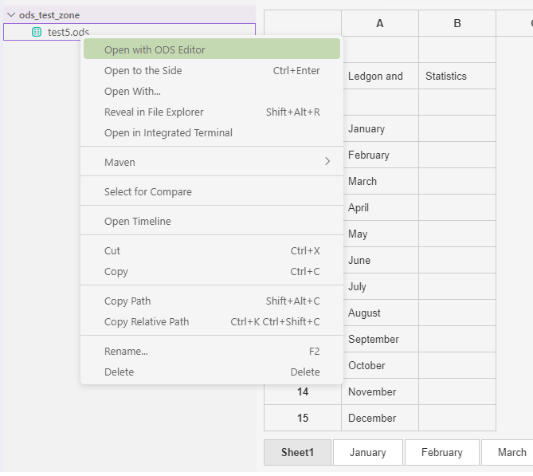
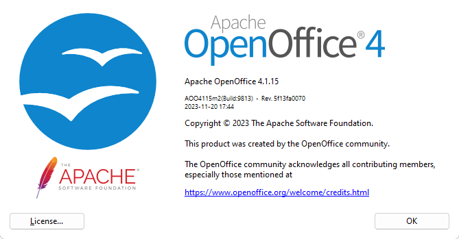
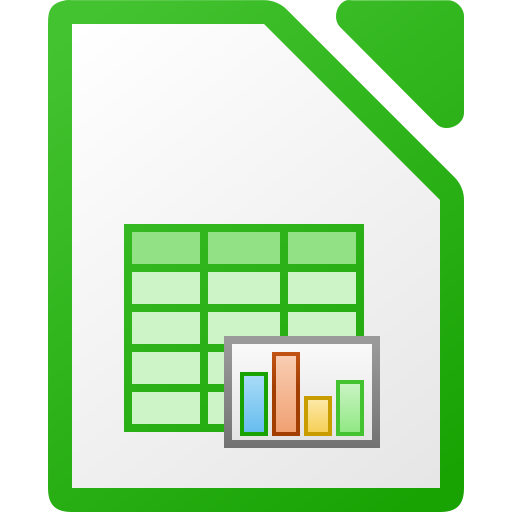

# Simple ODS Reader/Writer - Editor for Visual Studio Code

<div style="display: flex; align-items: center; background: #f3f3f3; padding: 16px; border-radius: 4px; margin-bottom: 20px;">
    
    <div style="margin-left: 16px;">
        <h2 style="margin: 0;">ODS Editor</h2>
        <p style="margin: 4px 0; color: #666;">Basic OpenDocument Spreadsheet Editor for VS Code</p>
        <div>
            <span style="background: #5C2D91; color: white; padding: 6px 16px; border-radius: 3px; display: inline-block; margin-right: 8px;">Install</span>
            <span style="border: 1px solid #5C2D91; color: #5C2D91; padding: 6px 16px; border-radius: 3px; display: inline-block;">Uninstall</span>
        </div>
    </div>
</div>

A simple extension for viewing and editing OpenDocument Spreadsheets (ODS) in Visual Studio Code. Currently in early development.



## Supported ODS Version



## Current Features

✨ **Basic Spreadsheet Interface**
- View and edit cell contents in VS Code
- Basic sheet navigation
- Simple text editing (formatting coming soon)

🔄 **File Integration**
- Open .ods files from VS Code explorer
- Quick access from editor title menu
- Basic file handling

💾 **File Management**
- Read and extract .ods files to temporary storage
- Save changes back to .ods format
- Basic temporary file cleanup
- Note: Security improvements planned for file handling

## Project Background

This extension started as a learning project to understand:
- VS Code extension development with TypeScript/Node.js
- OpenDocument Format (ODF) XML structure
- VS Code's webview API for custom editors

## Technical Stack

- **Language**: TypeScript/Node.js
- **XML Parsing**: fast-xml-parser
- **ODS Handling**: adm-zip
- **UI**: VS Code Webview API



The project references the OpenDocument Format used by LibreOffice, a free and open source office suite. Learn more about LibreOffice at [libreoffice.org](https://www.libreoffice.org/).

## Development Status

⚠️ **Early Development - Use with Caution**
- Basic functionality only
- Limited error handling
- Security improvements needed
- Not recommended for sensitive documents

## Installation

### From Source Code (Development)

1. Clone the repository:
   ```bash
   git clone https://github.com/snowcatman/vscode-ods-editor.git
   cd vscode-ods-editor
   ```

2. Install dependencies:
   ```bash
   npm install
   ```

3. Build the extension:
   ```bash
   npm run compile
   ```

4. Open in VS Code:
   ```bash
   code .
   ```

5. Debug:
   - Press F5 to start debugging
   - A new VS Code window will open with the extension loaded
   - Open any .ods file to test

### Development Requirements
- Node.js 14.x or newer
- npm (comes with Node.js)
- Visual Studio Code
- Git

### From VS Code Marketplace (Coming Soon)
Once published, you'll be able to install directly from VS Code:
1. Open VS Code
2. Go to Extensions (Ctrl+Shift+X)
3. Search for "ODS Editor"
4. Click Install

## Usage

### Opening Files

1. **Right-Click Method**
   - Right-click any .ods file
   - Select "Open with ODS Editor"

2. **Command Palette**
   - Press `Ctrl+Shift+P`
   - Type "Open with ODS Editor"
   - Select your file

3. **Editor Title Menu**
   - Click the ODS icon in the editor title bar
   - Your file opens in the spreadsheet view

### Editing

1. Click any cell to edit its content
2. Use arrow keys to navigate
3. Press Enter to save cell changes
4. Use `Ctrl+S` to save the file

### Saving

- File saves automatically convert back to ODS format
- Your default spreadsheet app opens automatically
- All formatting is preserved

## Requirements

- Visual Studio Code 1.85.0 or newer
- LibreOffice (recommended) or other ODS-compatible software

## Contributing

This extension is open source! We welcome contributions:

1. Fork the repository
2. Create a feature branch
3. Submit a pull request

## License

MIT License - feel free to use in your own projects!

The OpenDocument Format specification is used under the Mozilla Public License v2.0.

## Support

Found a bug? Have a feature request? Please open an issue on our GitHub repository.

## Further Credits 

This extension was created with Winsurf-Claude 3.5 Sonnet(https://codeium.com/) and Cursor-Claude 3.7 Sonnet(https://www.cursor.com/)